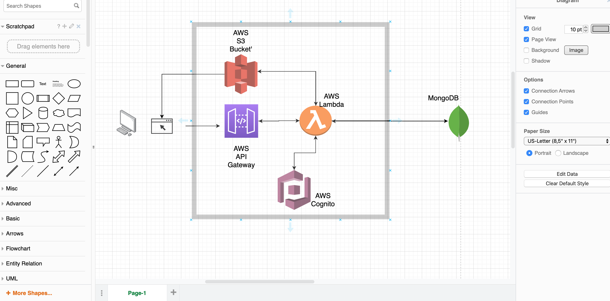

# HackZero API

API endpoints that connect to the fronted client for HackZero. Purpose of this is to manage hackathon event for any organizations.

## Functionality / Features

- User registration
- User authentication
- Adding hackathon ideas
- Editing hackathon ideas
- Providing users created hacks listing
- Join team to work on hacks

## Target Audience

This backend app is targeted at people who needs to connect their frontend client to be able to perform CRUD operation for their hackathons within their organizatios.

## Tech Stack

- MongoDB
- AWS API Gateway
- AWS Lambda
- AWS Cognito Authentication
- Serverless Framework

## Application Architecture Diagram



## Getting Started

These instructions will get you a copy of the project up and running on your local machine for development and testing purposes. See deployment for notes on how to deploy the project on a live system.

1. **git clone git@github.com:hackthehack/hack-zero-v2-backend.git**

2. cd into the directory and run **npm install**

3. Run a local server by running '**sls offline start**'

### Prerequisites

1. Must have NodeJS runtime installed

2. Install serverless framework by running **npm install -g serverless**

### Installing

To create a new Serverless project.

```bash
$ serverless install --url https://github.com/AnomalyInnovations/serverless-nodejs-starter --name my-project
```

Enter the new directory

```bash
$ cd my-project
```

Install the Node.js packages

```bash
$ npm install
```

### Demo

A demo version of this service is hosted on AWS - [`https://z6pv80ao4l.execute-api.us-east-1.amazonaws.com/dev/hello`](https://z6pv80ao4l.execute-api.us-east-1.amazonaws.com/dev/hello)

And here is the ES7 source behind it

```javascript
export const hello = async (event, context) => {
  return {
    statusCode: 200,
    body: JSON.stringify({
      message: `Go Serverless v1.0! ${await message({
        time: 1,
        copy: "Your function executed successfully!"
      })}`,
      input: event
    })
  };
};

const message = ({ time, ...rest }) =>
  new Promise((resolve, reject) =>
    setTimeout(() => {
      resolve(`${rest.copy} (with a delay)`);
    }, time * 1000)
  );
```

#### Environment Variables

To add environment variables to your project

1. Rename `env.example` to `.env`.
2. Add environment variables for your local stage to `.env`.
3. Uncomment `environment:` block in the `serverless.yml` and reference the environment variable as `${env:MY_ENV_VAR}`. Where `MY_ENV_VAR` is added to your `.env` file.
4. Make sure to not commit your `.env`.

#### Running Tests

Run your tests using

```bash
$ npm test
```

We use Jest to run our tests. You can read more about setting up your tests [here](https://facebook.github.io/jest/docs/en/getting-started.html#content)

## Authors

- **Stanley Huang**
- **Joseph Garner**
